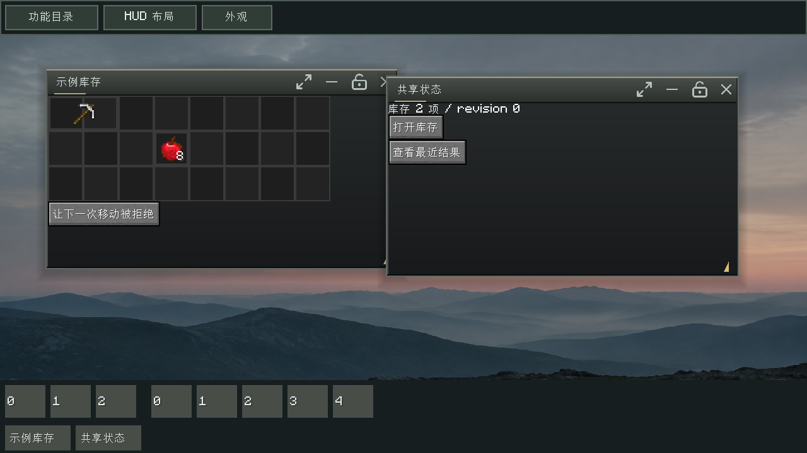
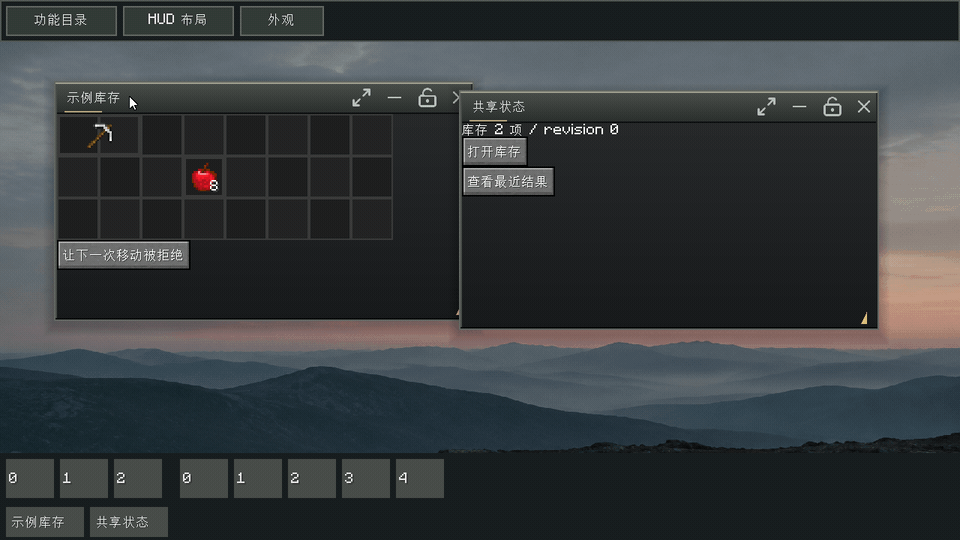

# Kizuna's Inventory UI Framework

面向 Minecraft 模组开发者的公共库存、窗口工作台和 HUD 基础框架。

开发者通过公开 API 注册窗口、操作、HUD 和主题，并通过明确的数据与请求契约连接自己的服务端。框架提供公共交互与通信路由，具体玩法、数据模型扩展和服务端规则由接入方实现。

**当前状态：公共框架能力已迁入并解耦，可构建框架 JAR 和独立示例 JAR；尚未发布稳定版本。** 已支持窗口目录／固定／拖动／尺寸调整、跨窗库存拖放／旋转／分堆、装备与自定义落点、模型预览和状态组件、槽位 HUD 投影、窗口固定 HUD、SVG 资源、灰绿主题、本地背景缩略图及布局保存。wire v1、模块协商与请求跟踪已通过本地 Fabric 服务端实机往返；生产业务事务仍由接入方验收。详见[框架边界](docs/wiki/Framework-Boundaries.md)。

## 演示

以下截图与动图录制于 **Windows Native / Minecraft 1.20.1 / Fabric / Java 17**。独立示例 JAR 提供模拟库存与状态数据，框架负责工作台、窗口交互、主题背景和动态槽位栏。

按住窗口标题栏即可拖动；窗口内容随外框一起移动，获得焦点的窗口置于最上层。下方 GIF 展示两个窗口依次拖动并回到原位。

使用 Java 17 运行 `./gradlew runDemo` 可体验同一示例；`./gradlew test build` 执行测试并构建。框架产物为 `build/libs/kizuna-inventory-ui-framework-0.1.0-SNAPSHOT.jar`，独立示例为同目录的 `-demo.jar`。运行时需要 Fabric API 和 owo-lib，详见[接入指南](docs/wiki/Getting-Started.md)。

## 目标

- 独立仓库、独立构建、版本化发布，一个框架 JAR 供业务子 JAR 依赖。
- 工作台主屏、窗口管理、库存组件、通用显示模型、状态绑定和 HUD 布局作为基础设施。
- 功能入口、窗口、HUD、主题和背景通过注册接入，取消写死的业务 tab 编号和 HUD 枚举清单。
- 明确服务器输入、客户端输出、模块缺失、协议不兼容和请求失败的行为。
- 独立演示环境使用模拟数据验证框架，无需部署业务服务端。

首个游戏适配目标为 **Minecraft 1.20.1 / Fabric / Java 17 / owo-lib**。框架 JAR 仍有这些运行时依赖；独立仓库不代表脱离 Minecraft 运行，也不代表子 JAR 可以在运行中卸载。

## 建议的主屏交互

主屏作为窗口工作台，提供“功能目录”“HUD 布局”“外观”三个明确入口。

- **功能目录**：模块注册入口后自动出现，支持分类、搜索和用户固定。点击打开或聚焦窗口，不通过切换一个全局 tab 隐藏其他窗口。
- **窗口栏**：显示已打开、最小化和用户固定的功能入口。内容动态生成，不占用游戏快捷栏的槽位编号。
- **HUD 布局**：列出已注册的 HUD，控制显隐、位置、缩放和恢复默认；普通窗口可固定复用原组件树，工位窗口禁止固定。
- **外观**：分别选择主题和背景，点击立即应用；模块提供默认值，用户偏好决定最终选择。

顶部目录／HUD／外观入口、底部动态栏位、用户固定入口和偏好保存已实现。默认视觉采用灰绿渐变、浅金强调色、细边高光、窗口动画与背景缩略图，业务窗口及专属美术由模块提供。注册 API 与入口布局分离，接入方无需依赖侧栏或顶部按钮等具体表现形式。

## 接入方式

- **宿主应用**：使用框架的客户端模组，负责初始化、数据适配和服务端连接。
- **扩展模块**：通过框架 API 提供窗口、库存功能、HUD 或主题，可以与宿主一起发布，也可以打包为独立子 JAR。
- **服务端实现**：遵循协商后的消息契约，或由宿主提供已有协议的适配器。框架不要求特定服务端项目或实现语言。

公共 API、文档和示例使用通用库存与界面概念。接入方的包名、玩法标识和网络生成类型不进入框架 API。

## 接入与扩展 Wiki

[在线 Wiki](https://github.com/Kizunad/Kizuna-Inventory-UI-Framework/wiki) 提供接入准备、子模块与窗口扩展、库存状态、HUD 与槽位栏、主题背景、服务器通信、故障排查及版本兼容说明。

文档源维护在本仓库的 [docs/wiki/](docs/wiki/Home.md)，随公开 API 变更一起更新。各页标注已实现 API 和后续设计，已发布状态见[版本与兼容性](docs/wiki/Versioning-and-Compatibility.md)。

## 设计文档

| 文档 | 内容 |
|---|---|
| [架构与注册边界](docs/architecture.md) | 框架职责、主屏、动态栏位、HUD、主题与背景 |
| [通信与模块契约](docs/protocol.md) | 模块能力、消息路由、请求结果、错误和状态同步 |
| [实施顺序与验收](docs/roadmap.md) | 框架开发、独立示例、兼容验证与版本发布 |

## 许可证

[MIT](LICENSE) · Copyright (c) 2026 Kizunad
