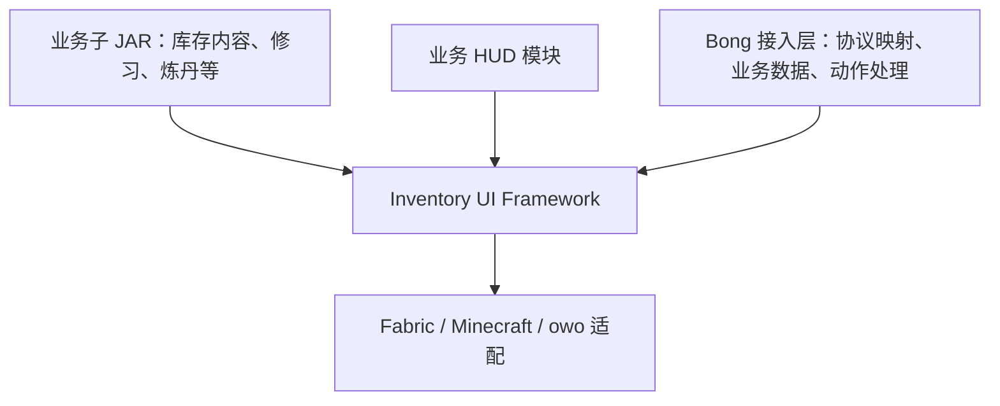

# 架构与注册边界

状态：设计草案。独立框架、动态注册和明确通信契约已确认；主屏交互布局是建议，尚未进行视觉验收。

## 1. 依赖方向

框架不得导入 Bong 的类、生成协议类型或业务 Store。子 JAR 依赖框架 API；框架只持有模块注册的接口实例，不引用具体子 JAR 类型。

初期对外发布一个框架 JAR，内部按职责划分 API、运行时、库存、HUD、主题和游戏适配。先完成实际需要的边界，不预先建立多套渲染后端或动态类加载系统。Fabric 负责加载子 JAR，框架负责发现并注册其中的模块；增删 JAR 需要重启客户端。

## 2. 框架与宿主的职责

| 范围 | 框架 | 宿主或业务模块 |
|---|---|---|
| 主屏 | 工作台、功能目录、窗口栏、HUD 和外观设置入口 | 注册功能及可用条件 |
| 窗口 | 实例标识、焦点、层级、输入捕获、最小化、布局 | 内容、业务关闭动作、会话有效性 |
| 库存 | 网格、槽位、占位、旋转、拖放、分堆交互 | 装备规则、物品使用效果、权威事务 |
| 模型 | 物品显示、容器和槽位的稳定数据契约 | 境界、真元、炼丹、制作等业务模型与转换 |
| 状态 | 快照读取、订阅、生命周期和界面临时状态 | 权威状态接收与业务计算 |
| HUD | 注册、布局、锚点、缩放、可见性与绘制承载 | 数据源、内容、玩法条件 |
| 外观 | 主题令牌、背景注册、资源生命周期 | 自有资源和主题默认值 |
| 通信 | 已登记消息的校验、分发、请求关联和错误 | 具体协议编解码、服务端业务处理 |

库存框架仍可包含库存专用能力，不必退化为一套只剩按钮的通用 GUI 库。独立性的边界是不会因新增一种 Bong 功法、丹药或服务器消息而要求修改框架源码。

## 3. 模块注册

每个模块声明稳定的 `moduleId`、模块版本、框架 API 兼容范围、必需模块和通信能力。ID 使用命名空间，例如 `bong:inventory`，不以 JAR 文件名或显示名称识别模块。

以下是拟定的注册项，不是已经实现的 Java 类型：

| 注册项 | 描述 |
|---|---|
| `FeatureEntry` | 功能 ID、标题、图标、分类、默认顺序、可用状态、打开动作 |
| `WindowDefinition` | 窗口类型、实例策略、内容工厂、尺寸约束、支持的操作 |
| `HudDefinition` | HUD ID、内容工厂、状态源、默认锚点和尺寸、编辑能力 |
| `SlotBarDefinition` | 栏位 ID、带稳定 ID 的槽位描述、显示与绑定接口 |
| `ThemeDefinition` | 颜色、文字、间距、边框、动画等语义化样式令牌 |
| `BackgroundDefinition` | 背景 ID、标题、资源引用、铺放方式、预览和遮罩配置 |
| `MessageContract` | 消息 ID、方向、数据类型、版本、状态或事件语义 |

规则：

- 所有注册项记录所属模块；重复 ID 是初始化错误，不能静默覆盖。
- 按依赖顺序初始化模块。模块注册先暂存并校验，成功后整体可见；失败时不留下半套窗口、HUD 或消息处理器。
- 必需依赖缺失时阻止依赖方启用；可选模块缺失时只影响对应能力。完整应用是否拒绝连接由宿主声明的必需能力决定。
- 启动完成后冻结定义。资源重载只替换资源，服务器状态只更新实例和可用性，均不偷偷重建模块注册表。
- 用户偏好按稳定 ID 保存。模块暂时缺失时保留对应偏好，不错误套用到别的模块。

## 4. 主屏建议：功能目录与独立窗口

当前 Bong 主屏使用 `TAB_EQUIP`、`TAB_CULTIVATION` 和 `TAB_NAMES` 等常量选择业务内容。提取后，入口来自 `FeatureEntry`，框架不会内建“修仙”“炼丹”等名称。

建议保留一个始终容易找到的“功能”按钮，展开可分类、可搜索的目录。用户可将常用入口固定到窗口栏。入口的图标、名称和打开动作来自同一份注册数据，不再维护多套列表。

点击入口的含义由窗口实例策略决定：

- 单例功能：已有窗口则恢复并聚焦，没有则创建。
- 按物品或容器区分的功能：同一物品或容器只保留一个窗口，不同对象允许并存。
- 依赖服务端会话的功能：先请求或检查权威会话；入口可见不代表获得操作权限。

窗口栏由已打开窗口和用户固定的功能入口生成。最小化窗口可以从这里恢复；数量较多时使用滚动或溢出列表，不能靠固定像素宽度挤压游戏快捷栏。

关闭工作台只结束主屏交互，不等价于关闭全部业务会话。明确关窗、暂时隐藏、最小化、对象失效、连接结束是不同原因；模块通过生命周期接口接收，避免炼丹或制作被切屏意外取消。

若一个子窗口自身适合分页，可使用普通 tab 组件。取消的是主屏硬编码的全局业务 tab 路由，不禁止局部 tab 控件。

## 5. HUD 与下方栏位分别注册

必须区分三种对象：

1. **窗口栏**：打开、恢复或聚焦窗口的本地入口。
2. **游戏槽位栏**：技能、物品或装备绑定，影响游戏操作。
3. **HUD 部件**：显示状态，可以包含一个游戏槽位栏的视图。

它们可以在视觉上相邻，但不能共享一组意义不明的数组索引。

`SlotBarDefinition` 提供栏位身份与槽位列表。槽位数量、是否解锁、接受何种内容以及当前绑定由模块提供的快照决定；框架负责排版、拖放反馈和提交绑定意图。不能通过修改主题或本地配置增加服务端允许的技能槽。

HUD 使用同一份槽位快照，避免主屏与 HUD 各维护一份绑定状态。拖动到槽位后显示请求中的状态，收到权威结果才确认；拒绝、超时或断线时清理临时反馈。

HUD 管理列表从 `HudDefinition` 生成，包含显隐、锚点、缩放、位置和恢复默认。模块指定允许用户编辑的范围；例如全屏遮罩不能被当成普通小窗口拖动。注册发生在启动阶段，连接后仍可更新数据驱动的槽位集合和显示条件。

普通窗口如支持固定为 HUD，必须显式提供 HUD 内容或投影；不自动把带按钮、输入框的整张窗口贴到游戏画面。窗口和 HUD 可以共用数据，但拥有独立的渲染和输入生命周期。

## 6. 主题与背景

主题负责组件样式，背景负责工作台底图，两者分别注册和选择。例如切换背景不应顺带改变字体大小或槽位容量。

主题使用语义化令牌，如 `surface`、`textPrimary`、`accent`、`spacingSmall`、`cornerRadius`，替代散落在主屏中的颜色与间距。仍应保留有明确物理、协议或组件约束含义的常量，不能把所有常量一律变成配置。

背景声明图片或内建绘制资源、`cover / contain / tile` 铺放方式以及遮罩。尺寸从实际资源获取，物品图标也通过资源描述获取尺寸，移除对统一 `128 × 128` 图标和固定背景大小的假设。

外观设置显示注册项的标题和预览。模块给默认值，资源包按资源 ID 替换外观，用户选择决定当前方案。资源缺失时回退到框架默认主题和纯色背景，同时提供可定位的诊断。

资源重载先验证并准备新资源，再替换当前资源；失败时保留可用画面，成功后释放旧纹理。偏好保存格式带版本，模块卸载后不因此删除用户的其他设置。

## 7. 当前代码需要拆开的地方

参考版本：Bong `4c842c33e`。

- `inventory/InspectScreen.java`：将业务 tab、菜单动作和直接网络调用分离，保留工作台组合与库存交互。
- `inventory/model/InventoryModel.java`：从通用库存模型移出境界、真元、骨币汇总和制作会话。
- `inventory/InventoryMoveService.java`：公开 API 不再引用 `ClientRequestProtocol.InvLocation`；由 Bong 接入层转换框架移动意图。
- `ui/window/UiWindowRuntime.java`：拆分公共窗口运行时与炼丹、锻造、修习等模块的装配代码。
- `hud/HudWidgetWindows.java`：替换写死的 `Widget` 枚举，以注册项构建 HUD 列表。
- `ui/adapter/owo/WorkspaceControls.java`：从注册表生成控制项，不遍历业务 HUD 枚举。
- `ui/adapter/owo/WorkspaceBackgrounds.java`：以资源注册和加载接口替换写死的背景名称和 Bong 资源路径。
- `ui/contract`、`ui/intent`、`ui/state`、`UiWindowManager`：优先核验和复用已有的状态、动作及生命周期边界，不重复建立同职责体系。
